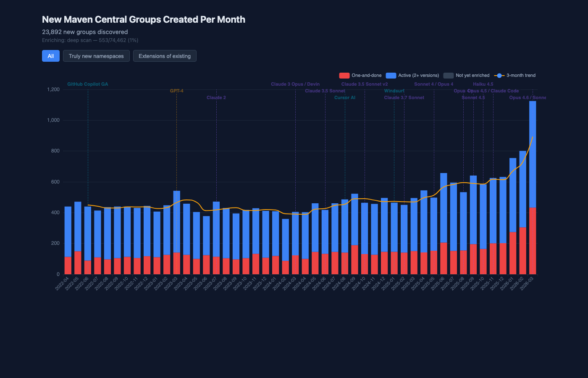
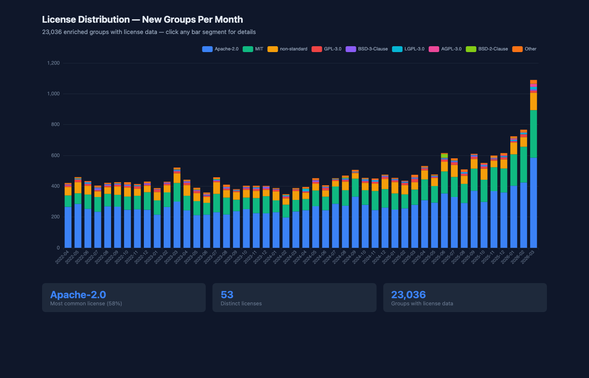
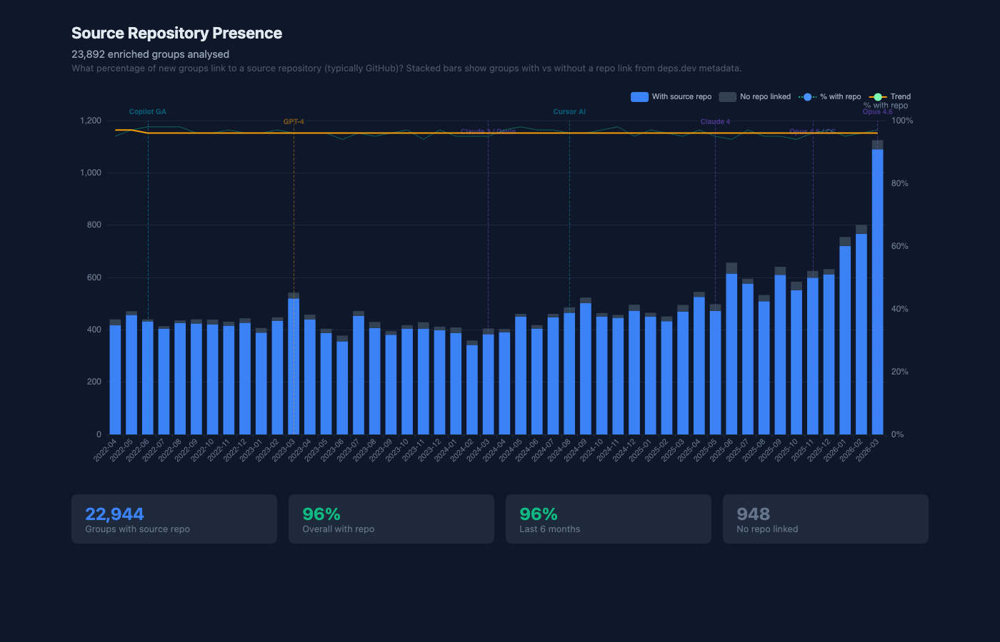

# Insights: Maven Central in the Age of AI

Analysis of ~74,000 Maven Central namespaces tracked from April 2022 to March 2026, spanning the introduction of GitHub Copilot, GPT-4, Claude, Cursor, and other AI coding tools.

## The Growth Story

Maven Central namespace creation has accelerated dramatically since mid-2024. But how much of this is genuinely new projects vs existing organisations expanding?

### Truly new vs extensions

Of **23,892 groups** created in the last 4 years:
- **9,348 (39%)** are truly new namespaces — organisations publishing to Maven Central for the first time
- **14,544 (61%)** are extensions of existing namespaces — established projects adding subgroups

The distinction matters. A new `com.google.cloud.newservice` isn't a new entrant — it's Google extending their SDK. But `ai.newstartup:agent-lib` represents a genuinely new participant in the Java ecosystem.

**Key finding:** The rate of truly new namespaces has roughly doubled since GPT-4's release (March 2023), suggesting AI tools are indeed lowering the barrier to publishing on Maven Central.

### Where the growth is

The fastest-growing prefixes in the last 12 months:

| Prefix | New groups | Notes |
|--------|-----------|-------|
| `io.*` | 3,776 | Dominant — includes JitPack (`io.github.*`) |
| `com.*` | 2,120 | Traditional corporate namespace |
| `org.*` | 796 | Open-source organisations |
| `dev.*` | 471 | Developer tools, growing fast |
| `ai.*` | 127 | Small but didn't exist pre-2023 |

The `io.*` prefix dominates because JitPack publishes GitHub projects as `io.github.{username}`, making it the easiest path for individual developers. This is exactly the "democratisation" signal — solo developers publishing via the path of least resistance.

## One-and-Done: The Abandonment Signal

Of 66,696 enriched groups with version data:
- **19,685 (30%)** published exactly one version and never updated
- **47,011 (70%)** have multiple versions

The one-and-done rate is a proxy for experimental or AI-generated projects that were published once and abandoned. The chart shows this rate over time — is it increasing in the AI era?

## License Trends

| License | Groups | Share |
|---------|--------|-------|
| Apache-2.0 | 38,018 | 57% |
| MIT | 11,527 | 17% |
| non-standard | 9,672 | 15% |
| GPL-3.0 | 1,486 | 2% |
| LGPL-3.0 | 898 | 1% |

Apache-2.0 dominates the Java ecosystem, but MIT is growing faster in recent months — possibly reflecting a shift toward simpler licensing driven by individual developers and AI-generated projects. The "non-standard" category includes custom licenses that don't map to SPDX identifiers.

## Source Repository Presence

The vast majority of groups link to a GitHub source repository — a trend that's been stable or slightly increasing. This suggests that even AI-assisted projects maintain source transparency, likely because deps.dev automatically extracts repo links from POM metadata.

## Security: Known Vulnerabilities

Of **44,768 OSV-enriched groups**, **397 have known CVEs** (~0.9%). While this seems low, it's concentrated in the most widely-used packages — the top vulnerable groups include:

- `io.netty` — 12 CVEs (CRITICAL)
- `org.yaml:snakeyaml` — 8 CVEs (HIGH)
- `org.bouncycastle` — 9 CVEs (MODERATE)
- `com.fasterxml.jackson.core` — 69 CVEs across artifacts

The CVE rate for groups created after 2024 is worth watching — are AI-era groups more or less likely to ship with known vulnerabilities?

## Namespace Depth

Maven Central groups range from 2 to 8 levels deep:

| Depth | Groups | Example |
|-------|--------|---------|
| 2 | 19,013 | `io.netty` |
| 3 | 41,798 | `com.google.cloud` |
| 4 | 4,985 | `com.fasterxml.jackson.core` |
| 5+ | 900 | `org.apache.tomee.patch.services` |

Depth 3 dominates — the standard `tld.org.project` pattern. Shallower groups (depth 2) tend to be older, established projects. The growth in depth-3 groups aligns with the increase in new namespaces.

## Open Questions

These insights raise several questions for further investigation:

1. **Solo committer rate** — once GitHub enrichment completes, what % of new groups are single-developer projects? Is this increasing?
2. **Time to second version** — are AI-era groups iterating faster, or abandoning more?
3. **Quality metrics** — for the top 100 most-depended-on groups, what do commit patterns, issue resolution rates, and code size tell us about development practices?
4. **JitPack effect** — how much of the growth is JitPack (`io.github.*`) vs traditional Maven publishing? Does JitPack usage correlate with AI tool adoption?

---

*Data collected by [Maven Central Trends](README.md). Last updated April 2026.*
