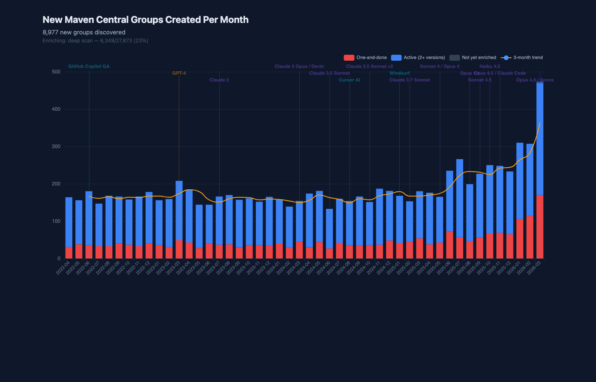
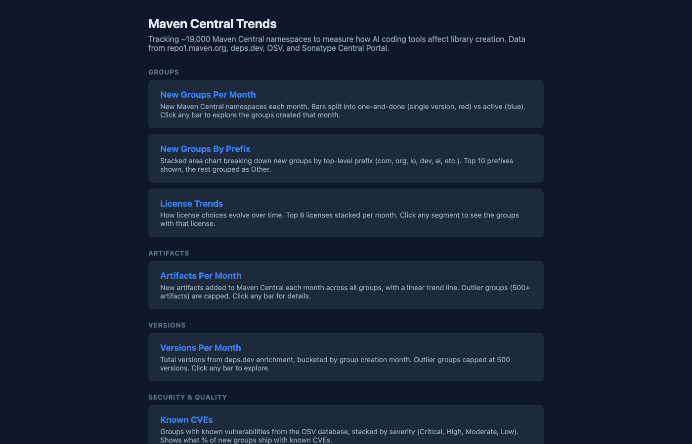

# Maven Central Publishing Trends

[](https://github.com/fiftiesHousewife/Maven-Central-Trends/actions/workflows/ci.yml)
[](https://go.dev)
[](LICENSE)

A Go service that tracks ~74,000 Maven Central namespaces to measure how AI coding tools affect library creation, quality, and community growth. 10 interactive charts with drill-down, powered by data from repo1.maven.org, deps.dev, OSV, Sonatype Central Portal, and GitHub.

**[Read the insights](INSIGHTS.md)** — analysis of Maven Central trends in the age of AI.





## Charts

All charts use ECharts with a dark theme, AI tool milestone annotations (Copilot GA, GPT-4, Claude releases, Cursor, etc.), and click-to-detail drill-down panels.

| # | Chart | Route | What it shows |
|---|-------|-------|---------------|
| 1 | **New Groups Per Month** | `/new-groups-per-month` | New namespaces each month, stacked into one-and-done (red) vs active (blue). Click any bar to explore groups |
| 2 | **New Groups By Prefix** | `/publishes-per-month` | Stacked area breaking down new groups by top-level prefix (com, org, io, dev, ai, etc.). Top 10 + Other |
| 3 | **License Trends** | `/license-trends` | License distribution per month. Top 8 licenses stacked, click any segment to filter |
| 4 | **Artifacts Per Month** | `/artifact-trends` | New artifacts across all groups with a linear trend line. Outliers capped at 500 |
| 5 | **Versions Per Month** | `/version-trends` | Version counts from deps.dev enrichment with trend line. Outliers capped at 500 |
| 6 | **Known CVEs** | `/cve-trends` | Groups with vulnerabilities by severity (Critical/High/Moderate/Low) + % affected trend |
| 7 | **Source Repo Presence** | `/source-repos` | % of groups linking to a source repo over time, with trend line |
| 8 | **Popularity Distribution** | `/popularity` | Log-scale histogram of dependent counts + top 25 most-depended-on groups |
| 9 | **Group Size Distribution** | `/size-distribution` | Artifact count buckets (1 / 2-5 / 6-50 / 50+) stacked per month |
| 10 | **Solo vs Team Contributors** | `/contributors` | Single-committer vs team projects over time, new-to-GitHub authors. Requires `GITHUB_TOKEN` |

## API Endpoints

| Endpoint | Description |
|----------|-------------|
| `GET /api/new-groups` | New groups per month |
| `GET /api/new-groups/details?month=2025-07` | Groups created in a specific month |
| `GET /api/scan-progress` | Live scan and enrichment progress |
| `GET /api/groups-by-prefix` | New groups by prefix per month |
| `GET /api/license-trends` | License distribution per month |
| `GET /api/one-and-done` | Single-version vs multi-version per month |
| `GET /api/growth` | New artifacts per month |
| `GET /api/version-trends` | Version counts per month |
| `GET /api/cve-trends` | CVE stats per month |
| `GET /api/source-repos` | Source repo presence per month |
| `GET /api/popularity` | Popularity distribution + top groups |
| `GET /api/size-distribution` | Group size distribution by month |
| `GET /api/contributors` | Solo vs team contributor stats per month |
| `GET /api/group-popularity?namespace=com.foo` | On-demand popularity for a namespace |
| `GET /api/new-artifacts-today` | New artifacts today (Solr) |
| `GET /health` | Health check |

## Running

```bash
brew install go

# Run directly
make run

# Or build and run in background
make build
nohup ./bin/server > server.log 2>&1 &

# With GitHub contributor enrichment (optional)
GITHUB_TOKEN=$(gh auth token) ./bin/server
```

The server starts on `:8080` (override with `PORT`). Set `LOG_LEVEL=debug` for verbose logging.

On first run, the server discovers ~28,000 Maven Central namespaces through a two-phase scan:
1. **Initial scan**: Enumerates 26 top-level prefixes on repo1, discovering ~19,000 two-level groups
2. **Deep scan**: Recurses into each group to find 3+ level namespaces (e.g. `com.fasterxml.jackson.core`), discovering ~9,000 more

Subsequent runs resume from stored data via prefix-level checkpointing.

## Testing

```bash
make test                          # Go unit tests
go test ./... -cover               # with coverage
npx playwright test                # E2E tests (server must be running)
npx playwright test --headed       # with visible browser
```

Coverage: config 100%, middleware 100%, store 84%, handler 19% (handler includes background goroutines that call external APIs).

## Architecture

### Data storage

SQLite database at `data/maven.db` (WAL mode, single connection).

| Table | Purpose |
|-------|---------|
| `groups` | ~28,000 Maven Central namespaces with enrichment data (license, CVEs, contributors, popularity) |
| `contributors` | Per-group contributor list from GitHub |
| `scan_progress` | Completed prefix scans for resume support |

### Background pipeline

Two goroutines start on boot:

1. **Group scan** — Enumerate 26 prefixes on repo1, discover groups, call deps.dev for first-publish dates
2. **Enrichment pipeline** — Runs sequentially after scan completes:
   - **Deep scan**: Discover 3+ level groupIds by recursing into existing groups
   - **deps.dev detail**: Fetch license, source repo, total version count (100ms throttle)
   - **OSV CVEs**: Query api.osv.dev across up to 5 artifacts per group (100ms throttle)
   - **Central Portal**: Fetch popularity metrics (3s throttle, 60s backoff on 429)
   - **GitHub**: Fetch contributor lists and account ages (1.2s throttle, requires `GITHUB_TOKEN`)

### Data sources

| Source | What we get | Auth | Rate limits |
|--------|-------------|------|-------------|
| **repo1.maven.org** | Namespace/artifact enumeration | None | None observed |
| **api.deps.dev** | Version history, licenses, source repos | None | None observed |
| **api.osv.dev** | CVE counts and severity | None | None observed |
| **central.sonatype.com** | Dependent counts, app counts | None | 429 after ~100 reqs |
| **api.github.com** | Contributors, account ages | `GITHUB_TOKEN` | 5,000/hr |

### How the scan works

Maven Central organises packages as `groupId:artifactId` where `groupId` uses reverse-domain notation (e.g. `com.google.cloud`). repo1 exposes this as a directory tree: `com/google/cloud/`.

The scanner:
1. Lists 26 top-level prefixes (`ai`, `com`, `dev`, `io`, `org`, etc.)
2. For each prefix, lists subdirectories to get two-level groups (`com.google`, `org.apache`)
3. **Deep scan**: For each two-level group, checks children — if a child directory contains more directories (not version numbers), it's a deeper namespace and gets registered (e.g. `com.google.cloud`, `org.apache.commons`)
4. For each group, calls deps.dev to find the first artifact's earliest publish date
5. Heuristic: entries containing hyphens are skipped during deep scan (artifact names like `spring-boot-starter`, not namespace components like `boot`)

### Partial month handling

The current month is excluded from all charts unless it's the 30th or 31st, to avoid misleadingly low bars for incomplete months.

## Other Approaches Attempted

| Source | Verdict |
|--------|---------|
| **Solr Search API** (`search.maven.org`) | Index stale for most groups after June 2025, aggressive rate limiting |
| **Central Portal Components** | Latest version date only, can't query historical ranges |
| **Central Portal Versions** | Sort by `publishedDate` is broken (random order) |
| **mvnrepository.com** | HTTP 403 for all API calls |
| **libraries.io** | Maven data quality too low, requires API key |
| **deps.dev + repo1** | **Chosen approach** — repo1 for enumeration, deps.dev for timestamps |
